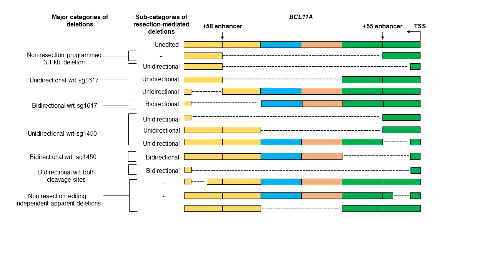
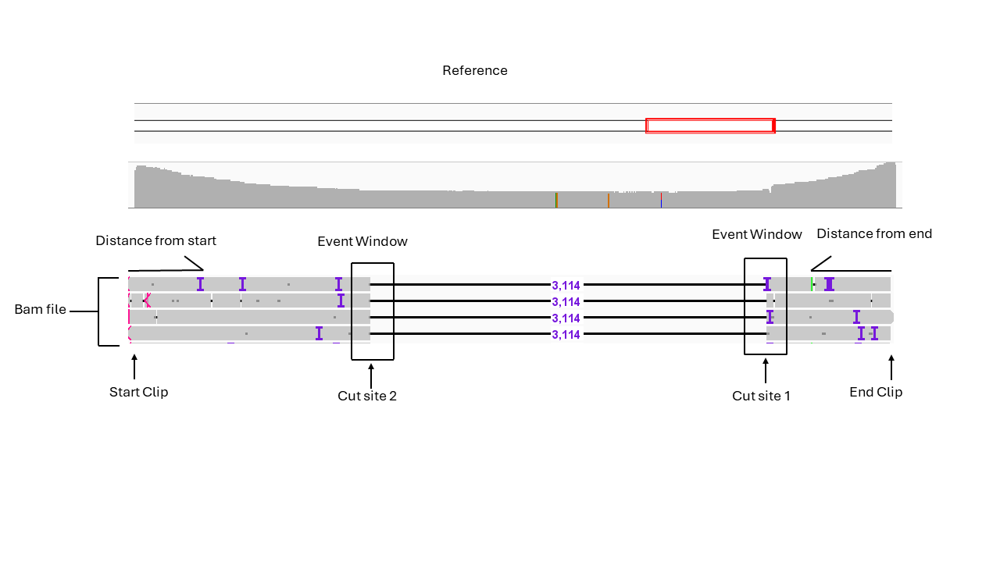
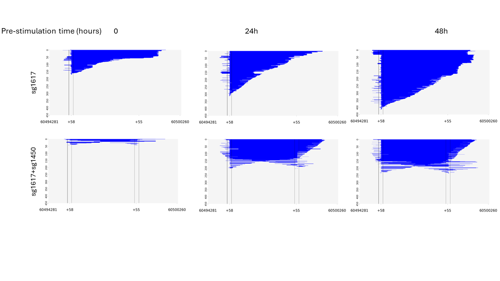

# Longview
Longview is a tool for analyzing and visualizing sequencing data generated by Oxford Nanopore Sequencing Technology from gene editing experiments. 
This python script will
- ```quantify resection-mediated deletion events ```
- ```generate plots to visualize deletion events wrt to the provided cleavage sites ```



## Instructions 
The users would need to generate bam files using sequencing alignment programs such as minimap2 and provide the following information that will be input for 
```process_bams_double_editing``` function
 - ```START_CLIP ``` This is the start index of your reads' bam file 
 - ```END_CLIP ``` This is the end index of your reads' bam file
 - ```DISTANCE_FROM_START_AND_END ``` This describes the distance in basepair from the forward and the reverse primer binding site to the window input by the user in the generated bam file to ensure removal of fragmented and incomplete reads 
 - ```REMOVE_START_END_SAME_LEN ``` Set this either to ```True``` or ```False```. If the user wants to include only the unique deletion events for their analysis, then set this to ```True``` and if the user wants to include all deletion events which could include duplicate events for their analysis, then set this to ```False``` . ```Unique deletion events ``` in this case are described as ones that have the same ```start and end index ```
 - ```CUT_SITE_1``` This is the index for your sgRNA1 cleavage site
 - ```CUT_SITE_2 ```This is the index for your sgRNA2 cleavage site
 - ```EVENT_WINDOW``` This describes the breakpoint window within +/- X basepair of sgRNA1 and sgRNA2 cleavage sites 
 - ```REGION_LEN ``` This describes the length of the deletion. Deletions <= ```REGION_LEN ``` will be categorized as short deletions and deletions > ```REGION_LEN ``` will be categorized as long deletions
- ```TYPE_OF_EVENT ``` This describes the type of event we are interested in quantifying such as deletions represented by CIGAR string "D" , insertions represented by CIGAR string "I", matches/mismatches represented by CIGAR string "M" etc.



### Example Input
```START_CLIP = 53395``` Start index of our reads' bam file  
```END_CLIP =   59374```  End index of our reads' bam file  
```DISTANCE_FROM_START_AND_END = 100 ``` Overlapping distance between the forward and reverser PCR primer binding site and reads' bam file. If reads don't align +/- 100 bp of ```START_CLIP``` ```AND``` ```END_CLIP```, then those reads are discarded from the analysis 
```REMOVE_START_END_SAME_LEN = True ``` Keeps only the unique deletion events for quantification and visualization  
```CUT_SITE_1 = 55282 ``` sg 1450 cleavage site  
```CUT_SITE_2 = 58389 ``` sg 1617 cleavage site  
``` EVENT_WINDOW = 100 ``` Extends cleavage window to +/- 100 bp of the both the cleavage sites provided  
```REGION_LEN = 25 ``` Deletions <=25 bp will be categorized as short deletions and deletions > 25 will be categorized as long deletions
```TYPE_OF_EVENT= "D" ``` D captures deletion event  

## Output



